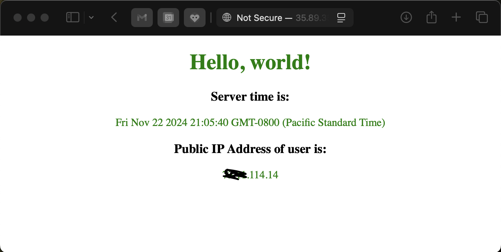

# Terraform AWS EC2 Nginx
Terraform AWS EC2 Nginx example. Remember to `destroy` it when done.

***WARNING!!! This might cause AWS charges.***

## Prerequisite
- Create a `Key pair` called `nginx-demo` and put it in your .ssh directory.

## Quick Start

```bash
% cd terraform
% terraform init
% terraform validate
% terraform plan
```
Browse to the IP address.


## Apply Changes

```bash
% terraform apply
```

## Destroy Stack
```bash
% terraform apply -destroy
```

## Pre-Commits

Run manually:

```bash
% pre-commit run -a
```